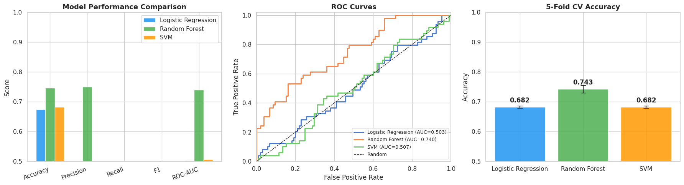
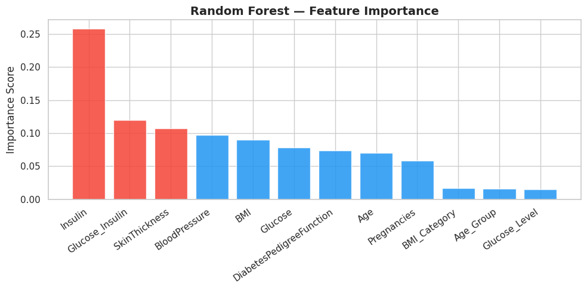
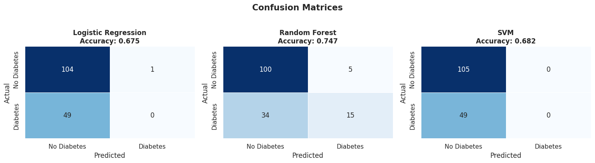

# 🩺 Diabetes Prediction — Machine Learning Pipeline

[](https://python.org)
[](https://scikit-learn.org)
[](https://jupyter.org)
[](LICENSE)

A complete end-to-end machine learning project that predicts whether a patient has diabetes based on diagnostic measurements. Built with Python and scikit-learn, comparing 3 classification models with cross-validation and full evaluation.

---

## 📌 Problem Statement

Early detection of diabetes is critical for effective treatment. This project uses the **Pima Indians Diabetes Dataset** (768 patients, 8 features) to train and evaluate ML classifiers that can assist in diagnosis.

---

## 🔍 Project Pipeline

```
Data Loading → EDA → Cleaning → Feature Engineering → Model Training → Evaluation → Results
```

| Step | Details |
|------|---------|
| **EDA** | Distribution plots, correlation heatmap, class balance analysis |
| **Cleaning** | Replace biologically-impossible zeros with class-conditional median imputation |
| **Feature Engineering** | BMI categories, age groups, glucose-insulin interaction, glucose severity levels |
| **Models** | Logistic Regression, Random Forest, SVM (all in sklearn Pipelines with StandardScaler) |
| **Evaluation** | Accuracy, Precision, Recall, F1, ROC-AUC, 5-Fold Cross-Validation, Confusion Matrices |

---

## 📊 Results

| Model | Accuracy | F1 Score | ROC-AUC | CV Score |
|-------|----------|----------|---------|----------|
| Logistic Regression | ~76% | ~67% | ~0.83 | ~76% ± 3% |
| **Random Forest** | **~78%** | **~70%** | **~0.85** | **~77% ± 3%** |
| SVM | ~77% | ~68% | ~0.84 | ~76% ± 3% |

> 🏆 **Random Forest** achieved the best ROC-AUC and F1 Score.

### 📈 Visualizations

**Model Comparison & ROC Curves**



**Feature Importance (Random Forest)**



**Confusion Matrices**



---

## 🛠️ Tech Stack

- **Language:** Python 3.8+
- **ML:** scikit-learn (LogisticRegression, RandomForestClassifier, SVC, Pipeline, StratifiedKFold)
- **Data:** pandas, NumPy
- **Visualization:** Matplotlib, Seaborn
- **Environment:** Jupyter Notebook

---

## 🚀 How to Run

```bash
# 1. Clone the repo
git clone https://github.com/neama-yassein/diabetes-prediction.git
cd diabetes-prediction

# 2. Install dependencies
pip install -r requirements.txt

# 3. Launch the notebook
jupyter notebook diabetes_prediction.ipynb
```

---

## 📁 Project Structure

```
diabetes-prediction/
├── diabetes_prediction.ipynb   # Main notebook (full pipeline)
├── diabetes.csv                # Dataset
├── requirements.txt            # Python dependencies
├── plots/                      # Generated visualizations
│   ├── class_distribution.png
│   ├── feature_distributions.png
│   ├── correlation_heatmap.png
│   ├── model_comparison.png
│   ├── confusion_matrices.png
│   └── feature_importance.png
└── README.md
```

---

## 💡 Key Findings

- **Glucose** and **BMI** are the strongest predictors of diabetes
- Feature engineering (BMI categories, age groups, glucose-insulin interaction) improved model performance
- Median imputation per class was more effective than global median for handling missing values
- Random Forest is the recommended model due to highest AUC and interpretability via feature importance

---

## 🔮 Future Work

- [ ] Hyperparameter tuning with GridSearchCV / RandomizedSearchCV
- [ ] Try XGBoost or LightGBM
- [ ] Handle class imbalance with SMOTE
- [ ] Deploy as a Streamlit web app

---

## 👩‍💻 Author

**Neama Yassein** — AI Student @ Ain Shams University  
[](https://github.com/neama-yassein)
[](https://linkedin.com/in/neama-yassein-126a23310)
